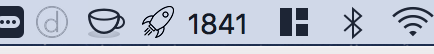

# 🚀 ReleaseDate

Simple release dates indicator that shows in the status bar the current date with the format [YEAR+WEEK_OF_YEAR].

# Download and Install

You can download the latest version of this App from [here]( https://github.com/dcordero/ReleaseDate/releases/download/1.0.0/ReleaseDate.app.zip)

To install it just copy the App to the `/Application` folder of your macOS.

[ReleaseDate](https://github.com/dcordero/ReleaseDate) will be automatically launched when your system starts.
